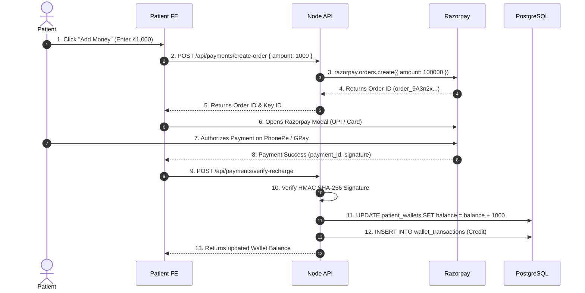
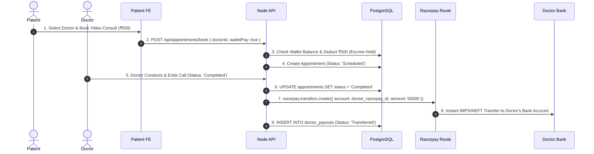

# Clinic-Cortex: Complete Real Payment & Automated Doctor Bank Payout Guide

This document provides an exhaustive, production-grade technical guide for integrating **real-money payments**, **patient wallet recharges**, and **automated payouts directly to doctors' bank accounts** in the **Clinic-Cortex** ecosystem.

---

## 📑 Table of Contents
1. [Architecture & System Overview](#1-architecture--system-overview)
2. [Technologies & Services Required](#2-technologies--services-required)
3. [Required API Keys & Credentials Checklist](#3-required-api-keys--credentials-checklist)
4. [End-to-End Workflow & Sequence Diagrams](#4-end-to-end-workflow--sequence-diagrams)
5. [Database Schema & SQL Migrations](#5-database-schema--sql-migrations)
6. [Backend API Implementation Details](#6-backend-api-implementation-details)
7. [Frontend Integration Details](#7-frontend-integration-details)
8. [Automated Doctor Bank Account Payouts](#8-automated-doctor-bank-account-payouts)
9. [Webhooks, Security & Compliance](#9-webhooks-security--compliance)
10. [Refunds & Cancellation Policy Flow](#10-refunds--cancellation-policy-flow)

---

## 1. Architecture & System Overview

The Clinic-Cortex Payment System handles two core financial workflows:

1. **Patient Wallet & Direct Booking Payments**:
   - Patients can recharge their **ClinicCortex Digital Wallet** or pay directly for appointments using **UPI (Google Pay, PhonePe, Paytm), Credit/Debit Cards, or NetBanking**.
2. **Automated Doctor Bank Account Payouts**:
   - When a patient completes a consultation, consultation fees are automatically split and transferred directly to the **Doctor's linked Savings/Current Bank Account** via IMPS/NEFT using **Razorpay Route**.

```
+------------------+         +------------------+         +-----------------------+
|  Patient Portal  | ------> | Express Backend  | ------> | Razorpay Payment Engine|
| (UPI/Card/Wallet)|         |   (PostgreSQL)   |         |    (Routing & Escrow) |
+------------------+         +------------------+         +-----------------------+
                                                                      |
                                                                      v
                                                          +-----------------------+
                                                          |  Doctor Bank Account  |
                                                          |   (IMPS / NEFT Payout)|
                                                          +-----------------------+
```

---

## 2. Technologies & Services Required

### A. Primary Payment Processor (For India)
- **Razorpay Checkout & Razorpay Route**:
  - **Razorpay Checkout**: Renders native UPI (GPay, PhonePe), Card, and NetBanking modals on the Patient Portal.
  - **Razorpay Route (Linked Accounts)**: Handles multi-party split payouts directly to doctors' verified bank accounts without storing sensitive bank credentials on your servers.

*(Alternative for International Markets: **Stripe Connect**)*

### B. NPM Packages & Libraries

| Environment | Library Name | Purpose |
| :--- | :--- | :--- |
| **Backend** (`server`) | `razorpay` | Official Razorpay Node.js SDK |
| **Backend** (`server`) | `crypto` | Native Node module for HMAC SHA-256 signature verification |
| **Backend** (`server`) | `pg` | PostgreSQL client for wallet ledger transactions |
| **Frontend** (`patient-fe`) | `checkout.js` | Hosted Razorpay Checkout Modal (`https://checkout.razorpay.com/v1/checkout.js`) |

---

## 3. Required API Keys & Credentials Checklist

Before going live, you (or your client) must obtain the following credentials from the **Razorpay Dashboard** (`https://dashboard.razorpay.com`):

### 🔑 Environment Variables Checklist

Add these variables to `server/.env`:

```env
# Razorpay API Credentials
RAZORPAY_KEY_ID=rzp_live_XXXXXXXXXXXXXX
RAZORPAY_KEY_SECRET=YYYYYYYYYYYYYYYYYYYYYYYY
RAZORPAY_WEBHOOK_SECRET=whsec_ZZZZZZZZZZZZZZZZZZZZZZZZ

# App Base URLs for Webhooks
APP_BASE_URL=https://api.cliniccortex.com
```

Add this variable to `cliniccortex-patient-fe/.env`:

```env
VITE_RAZORPAY_KEY_ID=rzp_live_XXXXXXXXXXXXXX
```

### 📋 Information Needed from Doctors for Bank Transfers
To register a doctor for automated bank payouts, collect the following details in the **Doctor Profile Settings**:

1. **Doctor Full Name** (matching bank account record)
2. **Bank Name & Branch**
3. **Account Number**
4. **IFSC Code** (e.g., `SBIN0001234`)
5. **PAN Number** (Required for T+1 / T+2 settlement by RBI)

---

## 4. End-to-End Workflow & Sequence Diagrams

### Flow A: Patient Recharging Wallet via UPI / Card



---

### Flow B: Booking Appointment & Transferring Money to Doctor's Bank Account



---

## 5. Database Schema & SQL Migrations

Run the following SQL migration on your PostgreSQL database to support real payments, doctor bank account linkage, and payout audit logs:

```sql
-- 1. Patient Wallets Table
CREATE TABLE IF NOT EXISTS patient_wallets (
    id UUID PRIMARY KEY DEFAULT gen_random_uuid(),
    patient_id UUID UNIQUE NOT NULL REFERENCES patients(id) ON DELETE CASCADE,
    balance NUMERIC(12, 2) DEFAULT 0.00,
    currency VARCHAR(10) DEFAULT 'INR',
    subscription_status VARCHAR(50) DEFAULT 'Free',
    created_at TIMESTAMP WITH TIME ZONE DEFAULT NOW(),
    updated_at TIMESTAMP WITH TIME ZONE DEFAULT NOW()
);

-- 2. Patient Wallet Transactions Ledger
CREATE TABLE IF NOT EXISTS wallet_transactions (
    id UUID PRIMARY KEY DEFAULT gen_random_uuid(),
    patient_id UUID NOT NULL REFERENCES patients(id) ON DELETE CASCADE,
    transaction_type VARCHAR(20) NOT NULL CHECK (transaction_type IN ('Credit', 'Debit', 'Refund')),
    amount NUMERIC(10, 2) NOT NULL,
    description TEXT,
    razorpay_payment_id VARCHAR(100),
    razorpay_order_id VARCHAR(100),
    created_at TIMESTAMP WITH TIME ZONE DEFAULT NOW()
);

-- 3. Extend Doctors Table with Bank & Razorpay Route Details
ALTER TABLE doctors 
ADD COLUMN IF NOT EXISTS razorpay_account_id VARCHAR(100),
ADD COLUMN IF NOT EXISTS bank_account_number VARCHAR(50),
ADD COLUMN IF NOT EXISTS bank_ifsc_code VARCHAR(20),
ADD COLUMN IF NOT EXISTS bank_account_holder VARCHAR(100),
ADD COLUMN IF NOT EXISTS pan_number VARCHAR(20);

-- 4. Doctor Payout Ledger Table
CREATE TABLE IF NOT EXISTS doctor_payouts (
    id UUID PRIMARY KEY DEFAULT gen_random_uuid(),
    doctor_id UUID NOT NULL REFERENCES doctors(id) ON DELETE CASCADE,
    appointment_id UUID REFERENCES appointments(id) ON DELETE SET NULL,
    amount NUMERIC(10, 2) NOT NULL,
    payout_status VARCHAR(50) DEFAULT 'Pending' CHECK (payout_status IN ('Pending', 'Transferred', 'Failed', 'Reversed')),
    razorpay_transfer_id VARCHAR(100),
    failure_reason TEXT,
    created_at TIMESTAMP WITH TIME ZONE DEFAULT NOW(),
    updated_at TIMESTAMP WITH TIME ZONE DEFAULT NOW()
);
```

---

## 6. Backend API Implementation Details

Create `server/src/routes/payment.routes.js` and register it in `server/src/index.js` under `/api/payments`.

```javascript
import express from 'express';
import Razorpay from 'razorpay';
import crypto from 'crypto';
import { query } from '../config/db.js';
import { authenticatePatientToken, authenticateToken } from '../middleware/auth.js';

const router = express.Router();

const razorpay = new Razorpay({
  key_id: process.env.RAZORPAY_KEY_ID,
  key_secret: process.env.RAZORPAY_KEY_SECRET,
});

// @route   POST /api/payments/create-order
// @desc    Create Razorpay Order for Wallet Recharge
router.post('/create-order', authenticatePatientToken, async (req, res) => {
  const { amount } = req.body; // Amount in INR

  if (!amount || amount < 10) {
    return res.status(400).json({ success: false, message: 'Minimum recharge amount is ₹10' });
  }

  try {
    const options = {
      amount: Math.round(amount * 100), // Amount in paise
      currency: 'INR',
      receipt: `w_recharge_${Date.now()}`,
      notes: {
        patient_id: req.patient.id,
      },
    };

    const order = await razorpay.orders.create(options);

    res.status(200).json({
      success: true,
      keyId: process.env.RAZORPAY_KEY_ID,
      order,
    });
  } catch (err) {
    console.error('Razorpay Create Order Error:', err);
    res.status(500).json({ success: false, message: 'Failed to create payment order' });
  }
});

// @route   POST /api/payments/verify-recharge
// @desc    Verify Razorpay HMAC Signature and Credit Patient Wallet
router.post('/verify-recharge', authenticatePatientToken, async (req, res) => {
  const { razorpay_order_id, razorpay_payment_id, razorpay_signature, amount } = req.body;

  if (!razorpay_order_id || !razorpay_payment_id || !razorpay_signature) {
    return res.status(400).json({ success: false, message: 'Missing payment verification tokens' });
  }

  try {
    // 1. Verify HMAC SHA-256 Signature
    const generatedSignature = crypto
      .createHmac('sha256', process.env.RAZORPAY_KEY_SECRET)
      .update(`${razorpay_order_id}|${razorpay_payment_id}`)
      .digest('hex');

    if (generatedSignature !== razorpay_signature) {
      return res.status(400).json({ success: false, message: 'Invalid payment signature' });
    }

    const patientId = req.patient.id;
    const creditAmount = parseFloat(amount);

    // 2. Database Transaction: Credit Wallet & Insert Ledger Record
    await query('BEGIN');

    await query(
      `INSERT INTO patient_wallets (patient_id, balance) 
       VALUES ($1, $2)
       ON CONFLICT (patient_id) 
       DO UPDATE SET balance = patient_wallets.balance + $2, updated_at = NOW()`,
      [patientId, creditAmount]
    );

    await query(
      `INSERT INTO wallet_transactions (patient_id, transaction_type, amount, description, razorpay_payment_id, razorpay_order_id)
       VALUES ($1, 'Credit', $2, 'Online Wallet Recharge', $3, $4)`,
      [patientId, creditAmount, razorpay_payment_id, razorpay_order_id]
    );

    await query('COMMIT');

    const updatedWallet = await query('SELECT * FROM patient_wallets WHERE patient_id = $1', [patientId]);

    res.status(200).json({
      success: true,
      message: 'Wallet recharged successfully!',
      wallet: updatedWallet.rows[0],
    });
  } catch (err) {
    await query('ROLLBACK');
    console.error('Verify Recharge Error:', err);
    res.status(500).json({ success: false, message: 'Server error processing wallet credit' });
  }
});

export default router;
```

---

## 7. Frontend Integration Details

Add the **Razorpay Checkout Modal** to the **Patient Portal Wallet Component** (`cliniccortex-patient-fe`):

```tsx
import React, { useState } from "react";
import { api } from "../lib/api";

declare global {
  interface Window {
    Razorpay: any;
  }
}

export function WalletRechargeModal({ onClose, onSuccess }: { onClose: () => void; onSuccess: () => void }) {
  const [amount, setAmount] = useState("500");
  const [loading, setLoading] = useState(false);

  const handleRecharge = async () => {
    setLoading(true);
    try {
      // 1. Request Order Creation from Backend
      const res = await api.post("/payments/create-order", { amount: parseFloat(amount) });
      if (!res.success || !res.order) {
        alert("Unable to initiate payment");
        setLoading(false);
        return;
      }

      // 2. Configure Razorpay Options
      const options = {
        key: res.keyId,
        amount: res.order.amount,
        currency: res.order.currency,
        name: "ClinicCortex Health",
        description: "Wallet Recharge",
        order_id: res.order.id,
        handler: async function (response: any) {
          // 3. Send Payment Signature to Backend for Verification
          const verifyRes = await api.post("/payments/verify-recharge", {
            razorpay_order_id: response.razorpay_order_id,
            razorpay_payment_id: response.razorpay_payment_id,
            razorpay_signature: response.razorpay_signature,
            amount: parseFloat(amount),
          });

          if (verifyRes.success) {
            alert("Wallet recharged successfully!");
            onSuccess();
            onClose();
          } else {
            alert(verifyRes.message || "Payment verification failed");
          }
        },
        theme: {
          color: "#163CC7",
        },
      };

      const rzp = new window.Razorpay(options);
      rzp.open();
    } catch (err: any) {
      alert(err.message || "Payment initiation error");
    } finally {
      setLoading(false);
    }
  };

  return (
    <div className="fixed inset-0 z-50 bg-black/60 backdrop-blur-sm flex items-center justify-center p-4">
      <div className="bg-white dark:bg-slate-900 rounded-3xl p-6 max-w-md w-full text-center space-y-4">
        <h3 className="text-xl font-bold">Recharge Digital Wallet</h3>
        <p className="text-xs text-slate-500">Enter amount to add via UPI, Card, or NetBanking</p>
        <input
          type="number"
          value={amount}
          onChange={(e) => setAmount(e.target.value)}
          className="w-full text-center text-3xl font-extrabold py-3 border rounded-2xl"
        />
        <div className="flex gap-3">
          <button onClick={onClose} className="flex-1 py-3 border rounded-2xl font-bold text-xs">Cancel</button>
          <button onClick={handleRecharge} disabled={loading} className="flex-1 py-3 bg-[#163CC7] text-white rounded-2xl font-bold text-xs">
            {loading ? "Processing..." : "Pay Now"}
          </button>
        </div>
      </div>
    </div>
  );
}
```

---

## 8. Automated Doctor Bank Account Payouts

When a doctor clicks **"End Call"** or completes a consultation, the system triggers the automated bank transfer to the doctor's bank account via **Razorpay Route**:

```javascript
// Function called upon consultation completion
export async function processDoctorPayout(appointmentId) {
  try {
    // 1. Fetch Appointment and Doctor Bank Details
    const aptRes = await query(
      `SELECT a.*, d.razorpay_account_id, d.clinic_fee, d.online_fee 
       FROM appointments a 
       JOIN doctors d ON a.doctor_id = d.id 
       WHERE a.id = $1`,
      [appointmentId]
    );

    const apt = aptRes.rows[0];
    if (!apt || !apt.razorpay_account_id) {
      console.warn(`Doctor has not linked a bank account for appointment ${appointmentId}`);
      return;
    }

    const fee = apt.visit_type === 'Clinic' ? (apt.clinic_fee || 500) : (apt.online_fee || 400);
    const amountInPaise = Math.round(fee * 100);

    // 2. Trigger Transfer to Doctor Bank Account via Razorpay Route API
    const transfer = await razorpay.transfers.create({
      account: apt.razorpay_account_id,
      amount: amountInPaise,
      currency: 'INR',
      notes: {
        appointment_id: appointmentId,
      },
    });

    // 3. Log Transfer in Doctor Payouts Table
    await query(
      `INSERT INTO doctor_payouts (doctor_id, appointment_id, amount, payout_status, razorpay_transfer_id)
       VALUES ($1, $2, $3, 'Transferred', $4)`,
      [apt.doctor_id, appointmentId, fee, transfer.id]
    );

    console.log(`Successfully transferred ₹${fee} to Doctor Bank Account (${apt.razorpay_account_id})`);
  } catch (err) {
    console.error('Doctor Bank Transfer Error:', err);
    await query(
      `INSERT INTO doctor_payouts (doctor_id, appointment_id, amount, payout_status, failure_reason)
       VALUES ($1, $2, 0, 'Failed', $3)`,
      [apt?.doctor_id, appointmentId, err.message]
    );
  }
}
```

---

## 9. Webhooks, Security & Compliance

Razorpay sends webhooks to your server when payments succeed or fail asynchronously.

### Webhook Endpoint Implementation (`POST /api/webhooks/razorpay`)

```javascript
router.post('/webhook', express.raw({ type: 'application/json' }), async (req, res) => {
  const secret = process.env.RAZORPAY_WEBHOOK_SECRET;
  const signature = req.headers['x-razorpay-signature'];

  const expectedSignature = crypto
    .createHmac('sha256', secret)
    .update(req.body)
    .digest('hex');

  if (expectedSignature !== signature) {
    return res.status(400).send('Invalid Signature');
  }

  const event = JSON.parse(req.body);

  if (event.event === 'payment.captured') {
    const payment = event.payload.payment.entity;
    console.log('Payment Captured Successfully:', payment.id);
    // Asynchronous wallet update logic...
  }

  res.status(200).json({ status: 'ok' });
});
```

---

## 10. Refunds & Cancellation Policy Flow

If a patient or doctor cancels an upcoming appointment:

1. **Wallet Refund**:
   - The consultation fee is refunded instantly back to the `patient_wallets` table.
   - Insert transaction record: `transaction_type = 'Refund'`.
2. **Razorpay Reverse Transfer**:
   - If funds were already transferred to the doctor's linked account, issue a transfer reversal via:
     `razorpay.transfers.reverse(transfer_id, { amount: amountInPaise })`.

---

## 🔑 Summary of Files Added / Modified

- `PAYMENT.md`: This comprehensive implementation guide.
- `server/src/routes/payment.routes.js`: Backend routes for order creation, signature verification, webhooks, and payouts.
- `cliniccortex-patient-fe/src/components/WalletRechargeModal.tsx`: Real Razorpay Checkout modal for patient wallet recharges.
