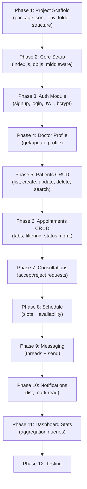

# Plan 2 of 2 — Backend Server (Express.js)

> This document covers the **Express.js backend server** only. For the PostgreSQL database schema and setup, see [Plan 1 — Database (PostgreSQL)](file:///C:/Users/admin/.gemini/antigravity-ide/brain/66b08b41-4fb9-4ebf-8ca4-136c527c0214/implementation_plan.md).

---

## Goal

Build a REST API server using **Express.js** that connects to the PostgreSQL database (Plan 1) and serves all the data the frontend currently fetches from localStorage / hardcoded arrays.

---

## Open Questions

> [!IMPORTANT]
> **File Uploads (Profile Photos)** — The [Signup.tsx](file:///c:/Users/admin/Desktop/BCA/5th%20SEM/Clinic-Cortex/Doctordashboarddesign/src/app/components/Signup.tsx) form has a profile photo upload. Should we:
> - **A)** Store files on local disk (`server/uploads/` folder)?
> - **B)** Use a cloud service (Cloudinary, AWS S3)?
> - **C)** Skip file upload for now and add later?

> [!IMPORTANT]
> **Real-Time Messaging** — The [Inbox.tsx](file:///c:/Users/admin/Desktop/BCA/5th%20SEM/Clinic-Cortex/Doctordashboarddesign/src/app/components/Inbox.tsx) has a real-time chat UI. Should we:
> - **A)** Add **Socket.io** for real-time messaging now?
> - **B)** Keep it REST-only and add WebSockets later?

> [!IMPORTANT]
> **Frontend Integration** — After building the backend, should I also update the React components to call the API? Or keep the backend standalone first?

---

## Project Structure

```
Doctordashboarddesign/
├── src/                            # Existing frontend (UNCHANGED)
├── server/                         # NEW — Express backend
│   ├── package.json
│   ├── .env
│   ├── .env.example
│   ├── src/
│   │   ├── index.js                # Server entry point
│   │   ├── config/
│   │   │   └── db.js               # PostgreSQL connection pool
│   │   ├── middleware/
│   │   │   ├── auth.js             # JWT verification
│   │   │   ├── errorHandler.js     # Global error handler
│   │   │   └── validate.js         # Input validation rules
│   │   ├── routes/
│   │   │   ├── auth.routes.js
│   │   │   ├── doctor.routes.js
│   │   │   ├── patient.routes.js
│   │   │   ├── appointment.routes.js
│   │   │   ├── consultation.routes.js
│   │   │   ├── schedule.routes.js
│   │   │   ├── message.routes.js
│   │   │   ├── notification.routes.js
│   │   │   └── dashboard.routes.js
│   │   ├── controllers/
│   │   │   ├── auth.controller.js
│   │   │   ├── doctor.controller.js
│   │   │   ├── patient.controller.js
│   │   │   ├── appointment.controller.js
│   │   │   ├── consultation.controller.js
│   │   │   ├── schedule.controller.js
│   │   │   ├── message.controller.js
│   │   │   ├── notification.controller.js
│   │   │   └── dashboard.controller.js
│   │   ├── models/
│   │   │   ├── doctor.model.js
│   │   │   ├── patient.model.js
│   │   │   ├── appointment.model.js
│   │   │   ├── consultation.model.js
│   │   │   ├── schedule.model.js
│   │   │   ├── message.model.js
│   │   │   └── notification.model.js
│   │   └── utils/
│   │       ├── jwt.js              # Token generation/verification
│   │       └── hash.js             # bcrypt utilities
│   ├── db/
│   │   ├── schema.sql              # (from Plan 1)
│   │   └── seed.sql                # (from Plan 1)
│   └── tests/
│       └── api.test.js
└── package.json                    # Existing frontend package.json
```

---

## Dependencies

#### [NEW] `server/package.json`

| Package | Version | Purpose |
|---------|---------|---------|
| `express` | ^4.21.0 | HTTP server framework |
| `pg` | ^8.13.0 | PostgreSQL client — raw SQL queries, no ORM |
| `bcrypt` | ^5.1.1 | Password hashing (12 salt rounds) |
| `jsonwebtoken` | ^9.0.2 | JWT token creation & verification |
| `cors` | ^2.8.5 | Allow frontend (`localhost:5173`) to call backend |
| `helmet` | ^8.0.0 | HTTP security headers |
| `dotenv` | ^16.4.5 | Load `.env` file |
| `express-validator` | ^7.2.0 | Request body/params validation |
| `morgan` | ^1.10.0 | HTTP request logging |
| `express-rate-limit` | ^7.4.0 | Rate limiting on auth endpoints |
| `nodemon` | ^3.1.7 | (dev) Auto-restart server on file change |

---

## Environment Configuration

#### [NEW] `server/.env.example`

```env
# Server
PORT=5000
NODE_ENV=development

# Database (must match Plan 1 setup)
DB_HOST=localhost
DB_PORT=5432
DB_NAME=cliniccortex_db
DB_USER=postgres
DB_PASSWORD=postgres

# JWT
JWT_SECRET=your-super-secret-jwt-key-change-in-production
JWT_EXPIRES_IN=7d

# Frontend URL (for CORS whitelist)
FRONTEND_URL=http://localhost:5173
```

---

## Proposed Changes

### Core Server Setup

---

#### [NEW] `server/src/index.js`

Server entry point — initializes Express and mounts all middleware + routes.

```
Responsibilities:
├── Load environment variables (dotenv)
├── Create Express app
├── Apply middleware stack:
│   ├── helmet()           → Security headers
│   ├── cors({origin})     → Allow frontend origin
│   ├── morgan('dev')      → Request logging
│   ├── express.json()     → Parse JSON bodies
│   └── rateLimiter        → 100 requests/15min on /api/auth/*
├── Mount routes:
│   ├── /api/auth           → auth.routes.js
│   ├── /api/doctors        → doctor.routes.js
│   ├── /api/patients       → patient.routes.js
│   ├── /api/appointments   → appointment.routes.js
│   ├── /api/consultations  → consultation.routes.js
│   ├── /api/schedule       → schedule.routes.js
│   ├── /api/messages       → message.routes.js
│   ├── /api/notifications  → notification.routes.js
│   └── /api/dashboard      → dashboard.routes.js
├── Apply global error handler
└── Start server on PORT
```

---

#### [NEW] `server/src/config/db.js`

PostgreSQL connection pool using `pg`.

```js
// Conceptual design:
import pg from 'pg';
const pool = new pg.Pool({ /* env vars */ });

export const query = (text, params) => pool.query(text, params);
```

- Exports a `query()` helper used by all models
- Connection details from environment variables
- Pool size: 20 connections max (default)

---

### Middleware Layer

---

#### [NEW] `server/src/middleware/auth.js`

JWT authentication middleware that protects all routes except `/api/auth/signup` and `/api/auth/login`.

```
Flow:
1. Extract token from "Authorization: Bearer <token>" header
2. Verify token using jsonwebtoken
3. Attach { id, email } to req.doctor
4. Call next()

Error cases:
- Missing header → 401 "Authentication required"
- Invalid token  → 401 "Invalid or expired token"
```

---

#### [NEW] `server/src/middleware/errorHandler.js`

Global error handler — catches all unhandled errors.

```
Response format:
{
  "success": false,
  "message": "Human-readable error message",
  "error": "Detailed error (dev only)"
}

Status codes:
- 400 → Validation errors
- 401 → Auth errors
- 404 → Not found
- 500 → Server errors
```

---

#### [NEW] `server/src/middleware/validate.js`

Input validation rules using `express-validator`.

```
Validation chains:
├── signupValidation  → email format, password min 8 chars, first_name required
├── loginValidation   → email required, password required
├── patientValidation → name required, age is integer
└── appointmentValidation → date required, time required, visit_type in [Clinic,Video,Home]
```

---

### Utility Functions

---

#### [NEW] `server/src/utils/jwt.js`

```
Exports:
├── generateToken(doctorId)  → JWT with { id: doctorId }, expires in 7d
└── verifyToken(token)       → decoded payload or throws error
```

---

#### [NEW] `server/src/utils/hash.js`

```
Exports:
├── hashPassword(plaintext)       → bcrypt hash (12 salt rounds)
└── comparePassword(plain, hash)  → true/false
```

> [!WARNING]
> **Breaking Change**: The current frontend stores passwords in **plaintext** in localStorage. The backend will use **bcrypt hashing**. Users who signed up before the backend was added will need to re-register.

---

### API Endpoints (Routes → Controllers → Models)

Each module follows this pattern:
- **Route** — defines HTTP method + URL + middleware
- **Controller** — handles request/response logic
- **Model** — runs SQL queries against PostgreSQL

---

### Module 1: Authentication

#### [NEW] `server/src/routes/auth.routes.js`

| Method | Endpoint | Controller Method | Description |
|--------|----------|-------------------|-------------|
| `POST` | `/api/auth/signup` | `register` | Create doctor account |
| `POST` | `/api/auth/login` | `login` | Authenticate & return JWT |
| `POST` | `/api/auth/logout` | `logout` | Client-side token removal |
| `GET` | `/api/auth/me` | `getMe` | Get current doctor info (protected) |

**Signup flow:**
```
1. Validate input (email, password, first_name, last_name)
2. Check if email already exists → 409 Conflict
3. Hash password with bcrypt
4. INSERT into doctors table
5. Generate JWT token
6. Return { token, doctor: { id, name, email } }
```

**Login flow:**
```
1. Validate input (email, password)
2. SELECT doctor by email → 401 if not found
3. Compare password with bcrypt → 401 if mismatch
4. Generate JWT token
5. Return { token, doctor: { id, name, email } }
```

---

### Module 2: Doctor Profile

#### [NEW] `server/src/routes/doctor.routes.js`

| Method | Endpoint | Description |
|--------|----------|-------------|
| `GET` | `/api/doctors/profile` | Get full doctor profile |
| `PUT` | `/api/doctors/profile` | Update profile fields |
| `PUT` | `/api/doctors/password` | Change password |
| `PUT` | `/api/doctors/settings` | Update preferences |

All endpoints are **protected** (require JWT).

---

### Module 3: Patients

#### [NEW] `server/src/routes/patient.routes.js`

| Method | Endpoint | Description |
|--------|----------|-------------|
| `GET` | `/api/patients` | List all patients |
| `GET` | `/api/patients/:id` | Get single patient |
| `POST` | `/api/patients` | Create patient |
| `PUT` | `/api/patients/:id` | Update patient |
| `DELETE` | `/api/patients/:id` | Delete patient |
| `GET` | `/api/patients/:id/records` | Get medical records |
| `GET` | `/api/patients/:id/prescriptions` | Get prescriptions |

**Query parameters for `GET /api/patients`:**
- `?search=john` — search by name, condition, email, phone
- `?condition=hypertension` — filter by condition
- `?page=1&limit=20` — pagination

---

### Module 4: Appointments

#### [NEW] `server/src/routes/appointment.routes.js`

| Method | Endpoint | Description |
|--------|----------|-------------|
| `GET` | `/api/appointments` | List with filters |
| `GET` | `/api/appointments/:id` | Get single with vitals |
| `POST` | `/api/appointments` | Create appointment |
| `PUT` | `/api/appointments/:id` | Update / reschedule |
| `PATCH` | `/api/appointments/:id/status` | Change status only |
| `DELETE` | `/api/appointments/:id` | Delete appointment |

**Query parameters for `GET /api/appointments`:**
- `?tab=upcoming` — filters by status group (upcoming = Confirmed+Waiting+Scheduled)
- `?type=video` — filter by visit type
- `?search=john` — search by patient name or condition
- `?date=2026-04-02` — filter by date

---

### Module 5: Consultation Requests

#### [NEW] `server/src/routes/consultation.routes.js`

| Method | Endpoint | Description |
|--------|----------|-------------|
| `GET` | `/api/consultations` | List pending requests |
| `POST` | `/api/consultations` | Create new request |
| `PATCH` | `/api/consultations/:id/accept` | Accept request |
| `PATCH` | `/api/consultations/:id/reject` | Reject request |

---

### Module 6: Schedule

#### [NEW] `server/src/routes/schedule.routes.js`

| Method | Endpoint | Description |
|--------|----------|-------------|
| `GET` | `/api/schedule/slots` | Get slots (query `?day=monday`) |
| `POST` | `/api/schedule/slots` | Create time slot |
| `PUT` | `/api/schedule/slots/:id` | Edit slot |
| `DELETE` | `/api/schedule/slots/:id` | Delete slot |
| `GET` | `/api/schedule/availability` | Get weekly summary |
| `PUT` | `/api/schedule/availability/:day` | Toggle day Active/Inactive |

---

### Module 7: Messaging

#### [NEW] `server/src/routes/message.routes.js`

| Method | Endpoint | Description |
|--------|----------|-------------|
| `GET` | `/api/messages/threads` | List all threads |
| `GET` | `/api/messages/threads/:id` | Get messages in thread |
| `POST` | `/api/messages/threads/:id` | Send a message |

---

### Module 8: Notifications

#### [NEW] `server/src/routes/notification.routes.js`

| Method | Endpoint | Description |
|--------|----------|-------------|
| `GET` | `/api/notifications` | List all notifications |
| `PATCH` | `/api/notifications/:id/read` | Mark as read |
| `DELETE` | `/api/notifications/:id` | Delete notification |

---

### Module 9: Dashboard

#### [NEW] `server/src/routes/dashboard.routes.js`

| Method | Endpoint | Description |
|--------|----------|-------------|
| `GET` | `/api/dashboard/stats` | Aggregated stats |
| `GET` | `/api/dashboard/revenue` | Monthly revenue |
| `GET` | `/api/dashboard/chart` | Weekly chart data |

**`GET /api/dashboard/stats` response shape:**
```json
{
  "totalPatients": 1234,
  "todayAppointments": 18,
  "pendingRequests": 7,
  "completedVisits": 45
}
```

These values come from `COUNT(*)` queries on the `patients`, `appointments`, and `consultation_requests` tables.

---

## Implementation Order



---

## Verification Plan

### Manual API Testing (curl)

```bash
# 1. Start the server
cd server && npm run dev

# 2. Signup a doctor
curl -X POST http://localhost:5000/api/auth/signup \
  -H "Content-Type: application/json" \
  -d '{
    "firstName": "Sarah",
    "lastName": "Johnson",
    "email": "sarah.johnson@clinic.com",
    "password": "Test@1234"
  }'

# 3. Login
curl -X POST http://localhost:5000/api/auth/login \
  -H "Content-Type: application/json" \
  -d '{"email": "sarah.johnson@clinic.com", "password": "Test@1234"}'
# → Returns { token: "eyJ..." }

# 4. Get dashboard stats (protected)
curl http://localhost:5000/api/dashboard/stats \
  -H "Authorization: Bearer <paste-token-here>"

# 5. List patients (protected)
curl http://localhost:5000/api/patients \
  -H "Authorization: Bearer <paste-token-here>"

# 6. Create appointment
curl -X POST http://localhost:5000/api/appointments \
  -H "Content-Type: application/json" \
  -H "Authorization: Bearer <paste-token-here>" \
  -d '{
    "patientName": "John Smith",
    "patientAge": 45,
    "visitType": "Clinic",
    "date": "2026-04-05",
    "time": "09:00",
    "condition": "Follow-up"
  }'
```

### Automated Tests

```bash
# Run built-in Node.js test runner
cd server && npm test
```

Test cases:
- ✅ Signup returns 201 + token
- ✅ Login with correct credentials returns 200 + token
- ✅ Login with wrong password returns 401
- ✅ Protected route without token returns 401
- ✅ GET /patients returns array
- ✅ POST /appointments creates and returns appointment
- ✅ PATCH /appointments/:id/status updates status
- ✅ GET /dashboard/stats returns aggregated counts
