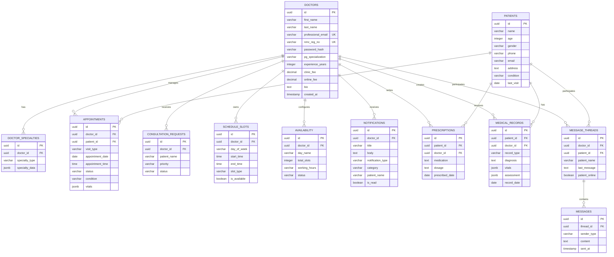

# Plan 1 of 2 — Database Setup (PostgreSQL)

> This document covers the **database layer only**. For the Express.js backend server, see [Plan 2 — Backend (Express.js)](file:///C:/Users/admin/.gemini/antigravity-ide/brain/66b08b41-4fb9-4ebf-8ca4-136c527c0214/implementation_plan_backend.md).

---

## Goal

Design and set up a PostgreSQL database for the ClinicCortex Doctor Dashboard that stores all the data currently hardcoded or kept in `localStorage` on the frontend.

---

## Current Data Sources (What We're Replacing)

| Data | Current Storage | Frontend File |
|------|----------------|---------------|
| Doctor credentials | `localStorage` key `cliniccortex-account` | [Login.tsx](file:///c:/Users/admin/Desktop/BCA/5th%20SEM/Clinic-Cortex/Doctordashboarddesign/src/app/components/Login.tsx) |
| Doctor profile | `localStorage` key `clinic_cortex_verified_doctor` | [doctorProfile.ts](file:///c:/Users/admin/Desktop/BCA/5th%20SEM/Clinic-Cortex/Doctordashboarddesign/src/app/lib/doctorProfile.ts) |
| Signup draft | `localStorage` key `clinic_cortex_signup_draft` | [Signup.tsx](file:///c:/Users/admin/Desktop/BCA/5th%20SEM/Clinic-Cortex/Doctordashboarddesign/src/app/components/Signup.tsx) |
| Appointments | `localStorage` key `cliniccortex-appointments` | [appointmentData.ts](file:///c:/Users/admin/Desktop/BCA/5th%20SEM/Clinic-Cortex/Doctordashboarddesign/src/app/lib/appointmentData.ts) |
| Patients | Hardcoded array (5 patients) | [Patients.tsx](file:///c:/Users/admin/Desktop/BCA/5th%20SEM/Clinic-Cortex/Doctordashboarddesign/src/app/components/Patients.tsx) |
| Schedule slots | Hardcoded array (9 slots) | [Schedule.tsx](file:///c:/Users/admin/Desktop/BCA/5th%20SEM/Clinic-Cortex/Doctordashboarddesign/src/app/components/Schedule.tsx) |
| Messages | Hardcoded array (3 threads) | [Inbox.tsx](file:///c:/Users/admin/Desktop/BCA/5th%20SEM/Clinic-Cortex/Doctordashboarddesign/src/app/components/Inbox.tsx) |
| Notifications | Hardcoded array (4 items) | [Notifications.tsx](file:///c:/Users/admin/Desktop/BCA/5th%20SEM/Clinic-Cortex/Doctordashboarddesign/src/app/components/Notifications.tsx) |
| Dashboard stats | Hardcoded values | [Dashboard.tsx](file:///c:/Users/admin/Desktop/BCA/5th%20SEM/Clinic-Cortex/Doctordashboarddesign/src/app/components/Dashboard.tsx) |

---

## Open Questions

> [!IMPORTANT]
> **Database Credentials** — The plan uses these defaults. Change them if needed:
> - **Database Name**: `cliniccortex_db`
> - **User**: `postgres`
> - **Password**: `postgres`
> - **Host**: `localhost`
> - **Port**: `5432`

> [!IMPORTANT]
> **PostgreSQL Version** — Do you already have PostgreSQL installed? If not, which version should we target? (Recommended: PostgreSQL 15 or 16)

---

## Entity Relationship Diagram



---

## Table Definitions

### File: `server/db/schema.sql`

---

### Table 1 — `doctors`
The central table storing all doctor profile data from the signup form.

```sql
CREATE EXTENSION IF NOT EXISTS "uuid-ossp";

CREATE TABLE doctors (
    id                    UUID PRIMARY KEY DEFAULT uuid_generate_v4(),
    -- Personal Identity
    salutation            VARCHAR(10) DEFAULT 'Dr.',
    first_name            VARCHAR(100) NOT NULL,
    middle_name           VARCHAR(100),
    last_name             VARCHAR(100) NOT NULL,
    dob                   DATE,
    gender                VARCHAR(20) DEFAULT 'Male',
    nationality           VARCHAR(50) DEFAULT 'Indian',
    profile_photo_url     VARCHAR(500),
    -- Government IDs
    aadhar_no             VARCHAR(20),
    pan_no                VARCHAR(20),
    passport_no           VARCHAR(20),
    -- Contact
    mobile                VARCHAR(20),
    whatsapp              VARCHAR(20),
    professional_email    VARCHAR(255) UNIQUE NOT NULL,
    personal_email        VARCHAR(255),
    -- Address
    clinic_address        TEXT,
    home_address          TEXT,
    city                  VARCHAR(100),
    state                 VARCHAR(100) DEFAULT 'Delhi',
    pincode               VARCHAR(10),
    gps_pin               VARCHAR(100),
    -- Medical Registration
    nmc_reg_no            VARCHAR(50) UNIQUE,
    smc_name              VARCHAR(200) DEFAULT 'Delhi Medical Council',
    reg_type              VARCHAR(50) DEFAULT 'Permanent',
    reg_year              VARCHAR(10),
    reg_expiry            DATE,
    lifetime_expiry       BOOLEAN DEFAULT FALSE,
    -- Education
    mbbs_university       VARCHAR(300),
    mbbs_year             VARCHAR(10),
    pg_degree             VARCHAR(100),
    pg_specialization     VARCHAR(200) DEFAULT 'None',
    super_specialization  VARCHAR(200),
    additional_certs      TEXT,
    nmc_uid               VARCHAR(50),
    -- Professional
    experience_years      INTEGER DEFAULT 0,
    employment_types      TEXT[],
    primary_hospital      VARCHAR(300),
    secondary_clinics     TEXT[],
    telemedicine_only     BOOLEAN DEFAULT FALSE,
    consult_languages     TEXT[],
    clinic_fee            DECIMAL(10,2) DEFAULT 500.00,
    online_fee            DECIMAL(10,2) DEFAULT 300.00,
    consult_duration      VARCHAR(20) DEFAULT '15 min',
    avail_days            TEXT[],
    avail_time_start      TIME DEFAULT '09:00',
    avail_time_end        TIME DEFAULT '17:00',
    -- Bio & Research
    bio                   TEXT,
    research_interests    TEXT,
    publications_count    INTEGER DEFAULT 0,
    pubmed_id             VARCHAR(50),
    awards                TEXT[],
    -- Auth
    password_hash         VARCHAR(255) NOT NULL,
    -- Consent
    consent_dpdp          BOOLEAN DEFAULT FALSE,
    consent_telemedicine  BOOLEAN DEFAULT FALSE,
    consent_tnc           BOOLEAN DEFAULT FALSE,
    -- Banking
    bank_name             VARCHAR(200),
    bank_account_no       VARCHAR(30),
    bank_ifsc             VARCHAR(20),
    gst_no                VARCHAR(30),
    -- Emergency Contact
    emergency_name        VARCHAR(200),
    emergency_relation    VARCHAR(100),
    emergency_phone       VARCHAR(20),
    -- Timestamps
    created_at            TIMESTAMP DEFAULT NOW(),
    updated_at            TIMESTAMP DEFAULT NOW()
);
```

> [!NOTE]
> This table has many columns because the [Signup.tsx](file:///c:/Users/admin/Desktop/BCA/5th%20SEM/Clinic-Cortex/Doctordashboarddesign/src/app/components/Signup.tsx) form collects 80+ fields across 5 stages. Array fields (`TEXT[]`) store multi-select values like languages, employment types, and awards.

---

### Table 2 — `doctor_specialties`
Stores specialty-specific data (Cardiology, Dermatology, Psychiatry, etc.) as flexible JSON.

```sql
CREATE TABLE doctor_specialties (
    id              UUID PRIMARY KEY DEFAULT uuid_generate_v4(),
    doctor_id       UUID NOT NULL REFERENCES doctors(id) ON DELETE CASCADE,
    specialty_type  VARCHAR(100) NOT NULL,
    specialty_data  JSONB NOT NULL DEFAULT '{}'
);
```

> [!TIP]
> Using `JSONB` here because each specialty (Cardiology, Dermatology, Psychiatry, Dental, etc.) has completely different fields. This avoids creating 20+ specialty-specific tables.

**Example JSONB for Cardiology:**
```json
{
  "subType": "Clinical Cardiology",
  "focus": "Adult",
  "interventional": true,
  "cathLabExp": "3",
  "echoCompetencies": ["2D Echo", "Stress Echo"],
  "deviceExp": ["Pacemaker", "ICD"]
}
```

---

### Table 3 — `patients`

```sql
CREATE TABLE patients (
    id          UUID PRIMARY KEY DEFAULT uuid_generate_v4(),
    name        VARCHAR(200) NOT NULL,
    age         INTEGER,
    gender      VARCHAR(20),
    dob         DATE,
    phone       VARCHAR(20),
    email       VARCHAR(255),
    address     TEXT,
    condition   VARCHAR(200),
    last_visit  DATE,
    created_at  TIMESTAMP DEFAULT NOW(),
    updated_at  TIMESTAMP DEFAULT NOW()
);
```

---

### Table 4 — `appointments`

```sql
CREATE TABLE appointments (
    id                UUID PRIMARY KEY DEFAULT uuid_generate_v4(),
    doctor_id         UUID NOT NULL REFERENCES doctors(id) ON DELETE CASCADE,
    patient_id        UUID REFERENCES patients(id) ON DELETE SET NULL,
    patient_name      VARCHAR(200),
    patient_age       INTEGER,
    visit_type        VARCHAR(20) NOT NULL DEFAULT 'Clinic',
    appointment_date  DATE NOT NULL,
    appointment_time  TIME NOT NULL,
    status            VARCHAR(30) NOT NULL DEFAULT 'Scheduled',
    condition         VARCHAR(200),
    notes             TEXT,
    vitals            JSONB,
    created_at        TIMESTAMP DEFAULT NOW(),
    updated_at        TIMESTAMP DEFAULT NOW()
);
```

> [!NOTE]
> **`visit_type`** values: `Clinic`, `Video`, `Home` — matching the frontend filter dropdown.
> **`status`** values: `Scheduled`, `Confirmed`, `Waiting`, `Completed`, `Cancelled`, `Missed` — matching the tab system in [Appointments.tsx](file:///c:/Users/admin/Desktop/BCA/5th%20SEM/Clinic-Cortex/Doctordashboarddesign/src/app/components/Appointments.tsx).
> **`vitals`** is JSONB storing: `{blood_glucose, hrv, spo2, temp, sleep, rhr}` — matching the expanded patient vitals view.

---

### Table 5 — `consultation_requests`

```sql
CREATE TABLE consultation_requests (
    id              UUID PRIMARY KEY DEFAULT uuid_generate_v4(),
    doctor_id       UUID NOT NULL REFERENCES doctors(id) ON DELETE CASCADE,
    patient_name    VARCHAR(200) NOT NULL,
    request_time    VARCHAR(100),
    request_type    VARCHAR(50) DEFAULT 'Virtual',
    priority        VARCHAR(20) DEFAULT 'Medium',
    notes           TEXT,
    status          VARCHAR(30) DEFAULT 'Pending',
    created_at      TIMESTAMP DEFAULT NOW()
);
```

---

### Table 6 — `schedule_slots`

```sql
CREATE TABLE schedule_slots (
    id            UUID PRIMARY KEY DEFAULT uuid_generate_v4(),
    doctor_id     UUID NOT NULL REFERENCES doctors(id) ON DELETE CASCADE,
    day_of_week   VARCHAR(15) NOT NULL,
    start_time    TIME NOT NULL,
    end_time      TIME NOT NULL,
    slot_type     VARCHAR(30) NOT NULL DEFAULT 'Clinic',
    is_available  BOOLEAN DEFAULT TRUE
);
```

> [!NOTE]
> **`slot_type`** values: `Clinic`, `Video`, `Home Visit`, `Break` — matching [Schedule.tsx](file:///c:/Users/admin/Desktop/BCA/5th%20SEM/Clinic-Cortex/Doctordashboarddesign/src/app/components/Schedule.tsx).

---

### Table 7 — `availability`

```sql
CREATE TABLE availability (
    id            UUID PRIMARY KEY DEFAULT uuid_generate_v4(),
    doctor_id     UUID NOT NULL REFERENCES doctors(id) ON DELETE CASCADE,
    day_name      VARCHAR(15) NOT NULL,
    total_slots   INTEGER DEFAULT 0,
    working_hours VARCHAR(50),
    status        VARCHAR(20) DEFAULT 'Active'
);
```

---

### Table 8 — `message_threads`

```sql
CREATE TABLE message_threads (
    id              UUID PRIMARY KEY DEFAULT uuid_generate_v4(),
    doctor_id       UUID NOT NULL REFERENCES doctors(id) ON DELETE CASCADE,
    patient_id      UUID REFERENCES patients(id) ON DELETE SET NULL,
    patient_name    VARCHAR(200),
    patient_avatar  VARCHAR(500),
    last_message    TEXT,
    last_message_at TIMESTAMP DEFAULT NOW(),
    patient_online  BOOLEAN DEFAULT FALSE
);
```

---

### Table 9 — `messages`

```sql
CREATE TABLE messages (
    id          UUID PRIMARY KEY DEFAULT uuid_generate_v4(),
    thread_id   UUID NOT NULL REFERENCES message_threads(id) ON DELETE CASCADE,
    sender_type VARCHAR(20) NOT NULL DEFAULT 'doctor',
    content     TEXT NOT NULL,
    sent_at     TIMESTAMP DEFAULT NOW()
);
```

---

### Table 10 — `notifications`

```sql
CREATE TABLE notifications (
    id                UUID PRIMARY KEY DEFAULT uuid_generate_v4(),
    doctor_id         UUID NOT NULL REFERENCES doctors(id) ON DELETE CASCADE,
    title             VARCHAR(200) NOT NULL,
    body              TEXT,
    notification_type VARCHAR(20) DEFAULT 'info',
    category          VARCHAR(50),
    patient_name      VARCHAR(200),
    is_read           BOOLEAN DEFAULT FALSE,
    created_at        TIMESTAMP DEFAULT NOW()
);
```

---

### Table 11 — `prescriptions`

```sql
CREATE TABLE prescriptions (
    id              UUID PRIMARY KEY DEFAULT uuid_generate_v4(),
    patient_id      UUID REFERENCES patients(id) ON DELETE CASCADE,
    doctor_id       UUID NOT NULL REFERENCES doctors(id) ON DELETE CASCADE,
    medication      TEXT NOT NULL,
    dosage          TEXT,
    instructions    TEXT,
    prescribed_date DATE DEFAULT CURRENT_DATE,
    created_at      TIMESTAMP DEFAULT NOW()
);
```

---

### Table 12 — `medical_records`

```sql
CREATE TABLE medical_records (
    id          UUID PRIMARY KEY DEFAULT uuid_generate_v4(),
    patient_id  UUID REFERENCES patients(id) ON DELETE CASCADE,
    doctor_id   UUID NOT NULL REFERENCES doctors(id) ON DELETE CASCADE,
    record_type VARCHAR(100),
    diagnosis   TEXT,
    notes       TEXT,
    vitals      JSONB,
    assessment  JSONB,
    record_date DATE DEFAULT CURRENT_DATE,
    created_at  TIMESTAMP DEFAULT NOW()
);
```

---

## Indexes (Performance)

```sql
-- Appointments: frequently filtered by doctor, date, and status
CREATE INDEX idx_appointments_doctor  ON appointments(doctor_id);
CREATE INDEX idx_appointments_date    ON appointments(appointment_date);
CREATE INDEX idx_appointments_status  ON appointments(status);

-- Patients: searched by name
CREATE INDEX idx_patients_name ON patients(name);

-- Notifications: filtered by doctor and read status
CREATE INDEX idx_notifications_doctor ON notifications(doctor_id);
CREATE INDEX idx_notifications_read   ON notifications(is_read);

-- Messages: fetched by thread
CREATE INDEX idx_messages_thread ON messages(thread_id);

-- Schedule: fetched by doctor + day
CREATE INDEX idx_schedule_doctor_day ON schedule_slots(doctor_id, day_of_week);
```

---

## Seed Data (`server/db/seed.sql`)

The seed file will pre-populate the database with the **same mock data** the frontend currently uses, ensuring a smooth transition. Here's what will be seeded:

| Table | Records | Source |
|-------|---------|--------|
| `doctors` | 1 (Dr. Sarah Johnson) | Default fallback in [doctorProfile.ts](file:///c:/Users/admin/Desktop/BCA/5th%20SEM/Clinic-Cortex/Doctordashboarddesign/src/app/lib/doctorProfile.ts) |
| `patients` | 5 | Hardcoded in [Patients.tsx](file:///c:/Users/admin/Desktop/BCA/5th%20SEM/Clinic-Cortex/Doctordashboarddesign/src/app/components/Patients.tsx) |
| `appointments` | 11 | `defaultAppointments` in [appointmentData.ts](file:///c:/Users/admin/Desktop/BCA/5th%20SEM/Clinic-Cortex/Doctordashboarddesign/src/app/lib/appointmentData.ts) |
| `consultation_requests` | 3 | `consultationRequests` in [Dashboard.tsx](file:///c:/Users/admin/Desktop/BCA/5th%20SEM/Clinic-Cortex/Doctordashboarddesign/src/app/components/Dashboard.tsx) |
| `schedule_slots` | 9 | `timeSlots` in [Schedule.tsx](file:///c:/Users/admin/Desktop/BCA/5th%20SEM/Clinic-Cortex/Doctordashboarddesign/src/app/components/Schedule.tsx) |
| `availability` | 7 (Mon–Sun) | `availability` in [Schedule.tsx](file:///c:/Users/admin/Desktop/BCA/5th%20SEM/Clinic-Cortex/Doctordashboarddesign/src/app/components/Schedule.tsx) |
| `message_threads` | 3 | `threads` in [Inbox.tsx](file:///c:/Users/admin/Desktop/BCA/5th%20SEM/Clinic-Cortex/Doctordashboarddesign/src/app/components/Inbox.tsx) |
| `messages` | 6 | `messages` in [Inbox.tsx](file:///c:/Users/admin/Desktop/BCA/5th%20SEM/Clinic-Cortex/Doctordashboarddesign/src/app/components/Inbox.tsx) |
| `notifications` | 4 | `notifications` in [Notifications.tsx](file:///c:/Users/admin/Desktop/BCA/5th%20SEM/Clinic-Cortex/Doctordashboarddesign/src/app/components/Notifications.tsx) |

---

## Setup Commands

```bash
# Step 1: Create the database
psql -U postgres -c "CREATE DATABASE cliniccortex_db;"

# Step 2: Run schema (creates all 12 tables + indexes)
psql -U postgres -d cliniccortex_db -f server/db/schema.sql

# Step 3: Seed with mock data
psql -U postgres -d cliniccortex_db -f server/db/seed.sql
```

---

## Verification Plan

```bash
# Verify tables exist
psql -U postgres -d cliniccortex_db -c "\dt"

# Verify doctor was seeded
psql -U postgres -d cliniccortex_db -c "SELECT id, first_name, last_name, professional_email FROM doctors;"

# Verify patients were seeded
psql -U postgres -d cliniccortex_db -c "SELECT id, name, condition FROM patients;"

# Verify appointments count
psql -U postgres -d cliniccortex_db -c "SELECT COUNT(*) FROM appointments;"

# Verify foreign key relationships work
psql -U postgres -d cliniccortex_db -c "SELECT a.patient_name, a.status, a.visit_type FROM appointments a JOIN doctors d ON a.doctor_id = d.id;"
```
