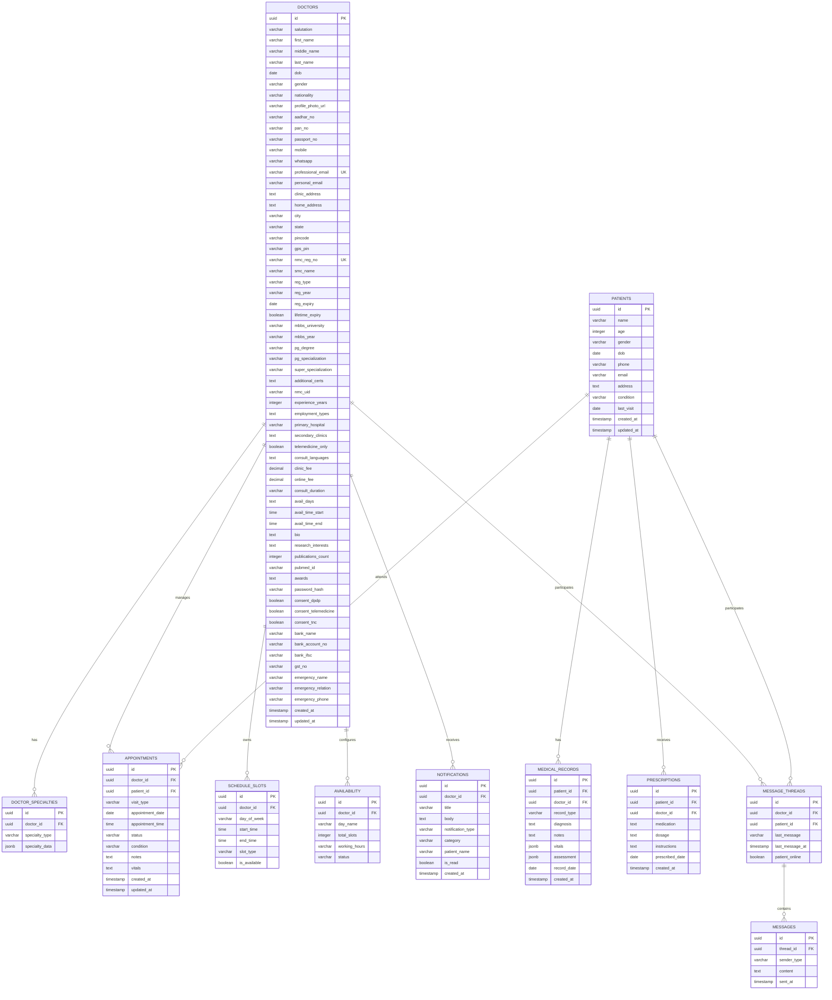
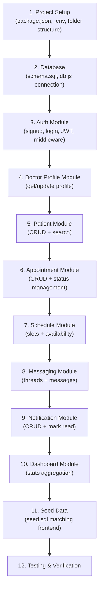

# ClinicCortex Backend & Database — Technical Document

Backend & database setup for the Doctor Dashboard using **Express.js** and **PostgreSQL**, designed to replace the current localStorage-based frontend with a proper server-side architecture.

---

## Current Frontend Analysis

The existing frontend is a **Vite + React + TypeScript** app with the following features and data models, all currently using **hardcoded mock data** and **localStorage**:

| Feature | Component | Current Data Source |
|---|---|---|
| Auth (Login/Signup) | [Login.tsx](file:///c:/Users/admin/Desktop/BCA/5th%20SEM/Clinic-Cortex/Doctordashboarddesign/src/app/components/Login.tsx), [Signup.tsx](file:///c:/Users/admin/Desktop/BCA/5th%20SEM/Clinic-Cortex/Doctordashboarddesign/src/app/components/Signup.tsx) | `localStorage` (`cliniccortex-auth`, `cliniccortex-account`) |
| Doctor Profile | [DoctorProfile.tsx](file:///c:/Users/admin/Desktop/BCA/5th%20SEM/Clinic-Cortex/Doctordashboarddesign/src/app/components/DoctorProfile.tsx), [doctorProfile.ts](file:///c:/Users/admin/Desktop/BCA/5th%20SEM/Clinic-Cortex/Doctordashboarddesign/src/app/lib/doctorProfile.ts) | `localStorage` (`clinic_cortex_verified_doctor`) |
| Appointments | [Appointments.tsx](file:///c:/Users/admin/Desktop/BCA/5th%20SEM/Clinic-Cortex/Doctordashboarddesign/src/app/components/Appointments.tsx), [appointmentData.ts](file:///c:/Users/admin/Desktop/BCA/5th%20SEM/Clinic-Cortex/Doctordashboarddesign/src/app/lib/appointmentData.ts) | `localStorage` (`cliniccortex-appointments`) |
| Patients | [Patients.tsx](file:///c:/Users/admin/Desktop/BCA/5th%20SEM/Clinic-Cortex/Doctordashboarddesign/src/app/components/Patients.tsx) | Hardcoded array |
| Schedule | [Schedule.tsx](file:///c:/Users/admin/Desktop/BCA/5th%20SEM/Clinic-Cortex/Doctordashboarddesign/src/app/components/Schedule.tsx) | Hardcoded array |
| Messages/Inbox | [Inbox.tsx](file:///c:/Users/admin/Desktop/BCA/5th%20SEM/Clinic-Cortex/Doctordashboarddesign/src/app/components/Inbox.tsx) | Hardcoded array |
| Notifications | [Notifications.tsx](file:///c:/Users/admin/Desktop/BCA/5th%20SEM/Clinic-Cortex/Doctordashboarddesign/src/app/components/Notifications.tsx) | Hardcoded array |
| Dashboard Stats | [Dashboard.tsx](file:///c:/Users/admin/Desktop/BCA/5th%20SEM/Clinic-Cortex/Doctordashboarddesign/src/app/components/Dashboard.tsx) | Hardcoded values |
| Settings | [Settings.tsx](file:///c:/Users/admin/Desktop/BCA/5th%20SEM/Clinic-Cortex/Doctordashboarddesign/src/app/components/Settings.tsx) | `localStorage` + hardcoded |

---

## User Review Required

> [!IMPORTANT]
> **Monorepo vs Separate Repo**: The plan creates the backend as a `server/` folder inside the existing project directory (monorepo approach). If you'd prefer a completely separate repository, let me know.

> [!IMPORTANT]
> **PostgreSQL Installation**: You'll need PostgreSQL installed locally (or a remote instance). The plan assumes a local PostgreSQL server on the default port `5432`. Please confirm you have PostgreSQL available.

> [!WARNING]
> **Breaking Change — Auth**: The current login/signup uses `localStorage` to store credentials in plaintext. The new backend will use **bcrypt password hashing** and **JWT tokens**. The signup and login components will need to be rewired to call the API instead of writing directly to localStorage.

---

## Open Questions

> [!IMPORTANT]
> **1. Database Name & Credentials**: What database name, username, and password would you like to use? The plan defaults to:
> - DB: `cliniccortex_db`
> - User: `postgres`
> - Password: `postgres`

> [!IMPORTANT]
> **2. File Uploads (Profile Photos)**: The signup form has a profile photo upload. Should we:
> - Store files on local disk (`/uploads` folder)?
> - Use a cloud service (e.g., Cloudinary, AWS S3)?
> - Skip file upload for now and add it later?

> [!IMPORTANT]
> **3. Real-Time Features**: The Inbox/Chat component has real-time messaging UI. Should we:
> - Add **Socket.io** for real-time messaging now?
> - Keep it REST-only for now and add WebSockets later?

> [!IMPORTANT]
> **4. Frontend Integration**: After building the backend, do you want me to also update the frontend components to call the API? Or just build the backend standalone?

---

## Proposed Architecture

```
Doctordashboarddesign/
├── src/                          # Existing frontend (unchanged)
├── server/                       # NEW — Express backend
│   ├── package.json
│   ├── .env
│   ├── .env.example
│   ├── src/
│   │   ├── index.js              # Entry point — server startup
│   │   ├── config/
│   │   │   └── db.js             # PostgreSQL connection pool (pg)
│   │   ├── middleware/
│   │   │   ├── auth.js           # JWT verification middleware
│   │   │   ├── errorHandler.js   # Global error handler
│   │   │   └── validate.js       # Input validation (express-validator)
│   │   ├── routes/
│   │   │   ├── auth.routes.js    # POST /signup, /login, /logout
│   │   │   ├── doctor.routes.js  # GET/PUT /profile, /settings
│   │   │   ├── patient.routes.js # CRUD /patients
│   │   │   ├── appointment.routes.js  # CRUD /appointments
│   │   │   ├── schedule.routes.js     # CRUD /schedule
│   │   │   ├── message.routes.js      # CRUD /messages
│   │   │   ├── notification.routes.js # CRUD /notifications
│   │   │   └── dashboard.routes.js    # GET /stats, /revenue
│   │   ├── controllers/
│   │   │   ├── auth.controller.js
│   │   │   ├── doctor.controller.js
│   │   │   ├── patient.controller.js
│   │   │   ├── appointment.controller.js
│   │   │   ├── schedule.controller.js
│   │   │   ├── message.controller.js
│   │   │   ├── notification.controller.js
│   │   │   └── dashboard.controller.js
│   │   ├── models/               # SQL query functions (no ORM)
│   │   │   ├── doctor.model.js
│   │   │   ├── patient.model.js
│   │   │   ├── appointment.model.js
│   │   │   ├── schedule.model.js
│   │   │   ├── message.model.js
│   │   │   └── notification.model.js
│   │   └── utils/
│   │       ├── jwt.js            # Token generation/verification
│   │       └── hash.js           # bcrypt utilities
│   ├── db/
│   │   ├── schema.sql            # All CREATE TABLE statements
│   │   └── seed.sql              # Seed data matching frontend mocks
│   └── tests/
│       └── api.test.js           # Basic API tests
└── package.json                  # Existing frontend package.json
```

---

## PostgreSQL Database Schema

### Entity Relationship Diagram



---

### Table Definitions (schema.sql)

#### [NEW] `server/db/schema.sql`

```sql
-- Enable UUID extension
CREATE EXTENSION IF NOT EXISTS "uuid-ossp";

-- ============================================
-- 1. DOCTORS TABLE
-- ============================================
CREATE TABLE doctors (
    id              UUID PRIMARY KEY DEFAULT uuid_generate_v4(),
    salutation      VARCHAR(10) DEFAULT 'Dr.',
    first_name      VARCHAR(100) NOT NULL,
    middle_name     VARCHAR(100),
    last_name       VARCHAR(100) NOT NULL,
    dob             DATE,
    gender          VARCHAR(20) DEFAULT 'Male',
    nationality     VARCHAR(50) DEFAULT 'Indian',
    profile_photo_url VARCHAR(500),
    aadhar_no       VARCHAR(20),
    pan_no          VARCHAR(20),
    passport_no     VARCHAR(20),
    mobile          VARCHAR(20),
    whatsapp        VARCHAR(20),
    professional_email VARCHAR(255) UNIQUE NOT NULL,
    personal_email  VARCHAR(255),
    clinic_address  TEXT,
    home_address    TEXT,
    city            VARCHAR(100),
    state           VARCHAR(100) DEFAULT 'Delhi',
    pincode         VARCHAR(10),
    gps_pin         VARCHAR(100),
    nmc_reg_no      VARCHAR(50) UNIQUE,
    smc_name        VARCHAR(200) DEFAULT 'Delhi Medical Council',
    reg_type        VARCHAR(50) DEFAULT 'Permanent',
    reg_year        VARCHAR(10),
    reg_expiry      DATE,
    lifetime_expiry BOOLEAN DEFAULT FALSE,
    mbbs_university VARCHAR(300),
    mbbs_year       VARCHAR(10),
    pg_degree       VARCHAR(100),
    pg_specialization VARCHAR(200) DEFAULT 'None',
    super_specialization VARCHAR(200),
    additional_certs TEXT,
    nmc_uid         VARCHAR(50),
    experience_years INTEGER DEFAULT 0,
    employment_types TEXT[],           -- Array of strings
    primary_hospital VARCHAR(300),
    secondary_clinics TEXT[],
    telemedicine_only BOOLEAN DEFAULT FALSE,
    consult_languages TEXT[],
    clinic_fee      DECIMAL(10,2) DEFAULT 500.00,
    online_fee      DECIMAL(10,2) DEFAULT 300.00,
    consult_duration VARCHAR(20) DEFAULT '15 min',
    avail_days      TEXT[],
    avail_time_start TIME DEFAULT '09:00',
    avail_time_end   TIME DEFAULT '17:00',
    bio             TEXT,
    research_interests TEXT,
    publications_count INTEGER DEFAULT 0,
    pubmed_id       VARCHAR(50),
    awards          TEXT[],
    password_hash   VARCHAR(255) NOT NULL,
    consent_dpdp    BOOLEAN DEFAULT FALSE,
    consent_telemedicine BOOLEAN DEFAULT FALSE,
    consent_tnc     BOOLEAN DEFAULT FALSE,
    bank_name       VARCHAR(200),
    bank_account_no VARCHAR(30),
    bank_ifsc       VARCHAR(20),
    gst_no          VARCHAR(30),
    emergency_name  VARCHAR(200),
    emergency_relation VARCHAR(100),
    emergency_phone VARCHAR(20),
    created_at      TIMESTAMP DEFAULT NOW(),
    updated_at      TIMESTAMP DEFAULT NOW()
);

-- ============================================
-- 2. DOCTOR SPECIALTIES (JSON per specialty)
-- ============================================
CREATE TABLE doctor_specialties (
    id              UUID PRIMARY KEY DEFAULT uuid_generate_v4(),
    doctor_id       UUID NOT NULL REFERENCES doctors(id) ON DELETE CASCADE,
    specialty_type  VARCHAR(100) NOT NULL,  -- e.g. 'Cardiology', 'Dermatology'
    specialty_data  JSONB NOT NULL DEFAULT '{}'
);

-- ============================================
-- 3. PATIENTS TABLE
-- ============================================
CREATE TABLE patients (
    id              UUID PRIMARY KEY DEFAULT uuid_generate_v4(),
    name            VARCHAR(200) NOT NULL,
    age             INTEGER,
    gender          VARCHAR(20),
    dob             DATE,
    phone           VARCHAR(20),
    email           VARCHAR(255),
    address         TEXT,
    condition       VARCHAR(200),
    last_visit      DATE,
    created_at      TIMESTAMP DEFAULT NOW(),
    updated_at      TIMESTAMP DEFAULT NOW()
);

-- ============================================
-- 4. APPOINTMENTS TABLE
-- ============================================
CREATE TABLE appointments (
    id                UUID PRIMARY KEY DEFAULT uuid_generate_v4(),
    doctor_id         UUID NOT NULL REFERENCES doctors(id) ON DELETE CASCADE,
    patient_id        UUID REFERENCES patients(id) ON DELETE SET NULL,
    patient_name      VARCHAR(200),       -- Denormalized for quick access
    patient_age       INTEGER,
    visit_type        VARCHAR(20) NOT NULL DEFAULT 'Clinic',  -- Clinic | Video | Home
    appointment_date  DATE NOT NULL,
    appointment_time  TIME NOT NULL,
    status            VARCHAR(30) NOT NULL DEFAULT 'Scheduled',
                      -- Scheduled | Confirmed | Waiting | Completed | Cancelled | Missed
    condition         VARCHAR(200),
    notes             TEXT,
    vitals            JSONB,              -- {blood_glucose, hrv, spo2, temp, sleep, rhr}
    created_at        TIMESTAMP DEFAULT NOW(),
    updated_at        TIMESTAMP DEFAULT NOW()
);

-- ============================================
-- 5. CONSULTATION REQUESTS
-- ============================================
CREATE TABLE consultation_requests (
    id              UUID PRIMARY KEY DEFAULT uuid_generate_v4(),
    doctor_id       UUID NOT NULL REFERENCES doctors(id) ON DELETE CASCADE,
    patient_name    VARCHAR(200) NOT NULL,
    request_time    VARCHAR(100),
    request_type    VARCHAR(50) DEFAULT 'Virtual',
    priority        VARCHAR(20) DEFAULT 'Medium',   -- High | Medium | Low
    notes           TEXT,
    status          VARCHAR(30) DEFAULT 'Pending',  -- Pending | Accepted | Rejected
    created_at      TIMESTAMP DEFAULT NOW()
);

-- ============================================
-- 6. SCHEDULE SLOTS
-- ============================================
CREATE TABLE schedule_slots (
    id              UUID PRIMARY KEY DEFAULT uuid_generate_v4(),
    doctor_id       UUID NOT NULL REFERENCES doctors(id) ON DELETE CASCADE,
    day_of_week     VARCHAR(15) NOT NULL,   -- monday, tuesday, etc.
    start_time      TIME NOT NULL,
    end_time        TIME NOT NULL,
    slot_type       VARCHAR(30) NOT NULL DEFAULT 'Clinic', -- Clinic | Video | Home Visit | Break
    is_available    BOOLEAN DEFAULT TRUE
);

-- ============================================
-- 7. WEEKLY AVAILABILITY
-- ============================================
CREATE TABLE availability (
    id              UUID PRIMARY KEY DEFAULT uuid_generate_v4(),
    doctor_id       UUID NOT NULL REFERENCES doctors(id) ON DELETE CASCADE,
    day_name        VARCHAR(15) NOT NULL,
    total_slots     INTEGER DEFAULT 0,
    working_hours   VARCHAR(50),
    status          VARCHAR(20) DEFAULT 'Active'   -- Active | Inactive
);

-- ============================================
-- 8. MESSAGE THREADS
-- ============================================
CREATE TABLE message_threads (
    id              UUID PRIMARY KEY DEFAULT uuid_generate_v4(),
    doctor_id       UUID NOT NULL REFERENCES doctors(id) ON DELETE CASCADE,
    patient_id      UUID REFERENCES patients(id) ON DELETE SET NULL,
    patient_name    VARCHAR(200),
    patient_avatar  VARCHAR(500),
    last_message    TEXT,
    last_message_at TIMESTAMP DEFAULT NOW(),
    patient_online  BOOLEAN DEFAULT FALSE
);

-- ============================================
-- 9. MESSAGES
-- ============================================
CREATE TABLE messages (
    id              UUID PRIMARY KEY DEFAULT uuid_generate_v4(),
    thread_id       UUID NOT NULL REFERENCES message_threads(id) ON DELETE CASCADE,
    sender_type     VARCHAR(20) NOT NULL DEFAULT 'doctor', -- doctor | patient
    content         TEXT NOT NULL,
    sent_at         TIMESTAMP DEFAULT NOW()
);

-- ============================================
-- 10. NOTIFICATIONS
-- ============================================
CREATE TABLE notifications (
    id                  UUID PRIMARY KEY DEFAULT uuid_generate_v4(),
    doctor_id           UUID NOT NULL REFERENCES doctors(id) ON DELETE CASCADE,
    title               VARCHAR(200) NOT NULL,
    body                TEXT,
    notification_type   VARCHAR(20) DEFAULT 'info', -- success | info | warning | danger
    category            VARCHAR(50),                 -- Appointment | Inbox | Review | Urgent
    patient_name        VARCHAR(200),
    is_read             BOOLEAN DEFAULT FALSE,
    created_at          TIMESTAMP DEFAULT NOW()
);

-- ============================================
-- 11. PRESCRIPTIONS
-- ============================================
CREATE TABLE prescriptions (
    id              UUID PRIMARY KEY DEFAULT uuid_generate_v4(),
    patient_id      UUID REFERENCES patients(id) ON DELETE CASCADE,
    doctor_id       UUID NOT NULL REFERENCES doctors(id) ON DELETE CASCADE,
    medication      TEXT NOT NULL,
    dosage          TEXT,
    instructions    TEXT,
    prescribed_date DATE DEFAULT CURRENT_DATE,
    created_at      TIMESTAMP DEFAULT NOW()
);

-- ============================================
-- 12. MEDICAL RECORDS
-- ============================================
CREATE TABLE medical_records (
    id              UUID PRIMARY KEY DEFAULT uuid_generate_v4(),
    patient_id      UUID REFERENCES patients(id) ON DELETE CASCADE,
    doctor_id       UUID NOT NULL REFERENCES doctors(id) ON DELETE CASCADE,
    record_type     VARCHAR(100),         -- Diagnosis, Lab Report, etc.
    diagnosis       TEXT,
    notes           TEXT,
    vitals          JSONB,                -- {weight, height, bmi, blood_pressure}
    assessment      JSONB,                -- {main_complaint, nursing_plan, status}
    record_date     DATE DEFAULT CURRENT_DATE,
    created_at      TIMESTAMP DEFAULT NOW()
);

-- ============================================
-- INDEXES for performance
-- ============================================
CREATE INDEX idx_appointments_doctor ON appointments(doctor_id);
CREATE INDEX idx_appointments_date ON appointments(appointment_date);
CREATE INDEX idx_appointments_status ON appointments(status);
CREATE INDEX idx_patients_name ON patients(name);
CREATE INDEX idx_notifications_doctor ON notifications(doctor_id);
CREATE INDEX idx_notifications_read ON notifications(is_read);
CREATE INDEX idx_messages_thread ON messages(thread_id);
CREATE INDEX idx_schedule_doctor_day ON schedule_slots(doctor_id, day_of_week);
```

---

## REST API Design

### Base URL: `http://localhost:5000/api`

### Authentication Endpoints

| Method | Endpoint | Description | Auth |
|--------|----------|-------------|------|
| `POST` | `/api/auth/signup` | Doctor registration (matches Signup.tsx fields) | No |
| `POST` | `/api/auth/login` | Doctor login → returns JWT | No |
| `POST` | `/api/auth/logout` | Invalidate token (client-side) | Yes |
| `GET`  | `/api/auth/me` | Get current logged-in doctor | Yes |

### Doctor Profile Endpoints

| Method | Endpoint | Description | Auth |
|--------|----------|-------------|------|
| `GET`  | `/api/doctors/profile` | Get doctor profile | Yes |
| `PUT`  | `/api/doctors/profile` | Update doctor profile | Yes |
| `PUT`  | `/api/doctors/settings` | Update settings/preferences | Yes |
| `PUT`  | `/api/doctors/password` | Change password | Yes |

### Patient Endpoints

| Method | Endpoint | Description | Auth |
|--------|----------|-------------|------|
| `GET`    | `/api/patients` | List all patients (with search & filter) | Yes |
| `GET`    | `/api/patients/:id` | Get single patient details | Yes |
| `POST`   | `/api/patients` | Create new patient | Yes |
| `PUT`    | `/api/patients/:id` | Update patient | Yes |
| `DELETE` | `/api/patients/:id` | Delete patient | Yes |
| `GET`    | `/api/patients/:id/records` | Get medical records | Yes |
| `GET`    | `/api/patients/:id/prescriptions` | Get prescriptions | Yes |

### Appointment Endpoints

| Method | Endpoint | Description | Auth |
|--------|----------|-------------|------|
| `GET`    | `/api/appointments` | List all (query: `?status=upcoming&type=clinic`) | Yes |
| `GET`    | `/api/appointments/:id` | Get single appointment with vitals | Yes |
| `POST`   | `/api/appointments` | Create new appointment | Yes |
| `PUT`    | `/api/appointments/:id` | Update (reschedule, change status) | Yes |
| `PATCH`  | `/api/appointments/:id/status` | Quick status change (cancel/complete) | Yes |
| `DELETE` | `/api/appointments/:id` | Delete appointment | Yes |

### Consultation Request Endpoints

| Method | Endpoint | Description | Auth |
|--------|----------|-------------|------|
| `GET`    | `/api/consultations` | List pending requests | Yes |
| `POST`   | `/api/consultations` | Create request | Yes |
| `PATCH`  | `/api/consultations/:id/accept` | Accept request | Yes |
| `PATCH`  | `/api/consultations/:id/reject` | Reject request | Yes |

### Schedule Endpoints

| Method | Endpoint | Description | Auth |
|--------|----------|-------------|------|
| `GET`    | `/api/schedule/slots` | Get all slots (query: `?day=monday`) | Yes |
| `POST`   | `/api/schedule/slots` | Create time slot | Yes |
| `PUT`    | `/api/schedule/slots/:id` | Edit slot | Yes |
| `DELETE` | `/api/schedule/slots/:id` | Delete slot | Yes |
| `GET`    | `/api/schedule/availability` | Get weekly availability summary | Yes |
| `PUT`    | `/api/schedule/availability/:day` | Toggle day active/inactive | Yes |

### Messaging Endpoints

| Method | Endpoint | Description | Auth |
|--------|----------|-------------|------|
| `GET`    | `/api/messages/threads` | List all conversation threads | Yes |
| `GET`    | `/api/messages/threads/:id` | Get messages in a thread | Yes |
| `POST`   | `/api/messages/threads/:id` | Send a message | Yes |

### Notification Endpoints

| Method | Endpoint | Description | Auth |
|--------|----------|-------------|------|
| `GET`    | `/api/notifications` | List all notifications | Yes |
| `PATCH`  | `/api/notifications/:id/read` | Mark as read | Yes |
| `DELETE` | `/api/notifications/:id` | Delete notification | Yes |

### Dashboard Endpoints

| Method | Endpoint | Description | Auth |
|--------|----------|-------------|------|
| `GET` | `/api/dashboard/stats` | Aggregated stats (total patients, today's appointments, pending, completed) | Yes |
| `GET` | `/api/dashboard/revenue` | Monthly revenue breakdown | Yes |
| `GET` | `/api/dashboard/chart` | Weekly appointment performance chart data | Yes |

---

## Dependencies

#### [NEW] `server/package.json`

```json
{
  "name": "cliniccortex-backend",
  "version": "1.0.0",
  "type": "module",
  "scripts": {
    "dev": "nodemon src/index.js",
    "start": "node src/index.js",
    "db:init": "psql -U postgres -d cliniccortex_db -f db/schema.sql",
    "db:seed": "psql -U postgres -d cliniccortex_db -f db/seed.sql",
    "test": "node --test tests/api.test.js"
  },
  "dependencies": {
    "express": "^4.21.0",
    "pg": "^8.13.0",
    "bcrypt": "^5.1.1",
    "jsonwebtoken": "^9.0.2",
    "cors": "^2.8.5",
    "helmet": "^8.0.0",
    "dotenv": "^16.4.5",
    "express-validator": "^7.2.0",
    "morgan": "^1.10.0",
    "express-rate-limit": "^7.4.0"
  },
  "devDependencies": {
    "nodemon": "^3.1.7"
  }
}
```

| Package | Purpose |
|---------|---------|
| `express` | HTTP server framework |
| `pg` | PostgreSQL client (raw SQL, no ORM) |
| `bcrypt` | Password hashing |
| `jsonwebtoken` | JWT token creation & verification |
| `cors` | Cross-Origin Resource Sharing |
| `helmet` | HTTP security headers |
| `dotenv` | Environment variables |
| `express-validator` | Request body/params validation |
| `morgan` | HTTP request logging |
| `express-rate-limit` | Rate limiting for auth endpoints |
| `nodemon` | Auto-restart dev server on changes |

---

## Environment Configuration

#### [NEW] `server/.env.example`

```env
# Server
PORT=5000
NODE_ENV=development

# Database
DB_HOST=localhost
DB_PORT=5432
DB_NAME=cliniccortex_db
DB_USER=postgres
DB_PASSWORD=postgres

# JWT
JWT_SECRET=your-super-secret-jwt-key-change-in-production
JWT_EXPIRES_IN=7d

# Frontend URL (for CORS)
FRONTEND_URL=http://localhost:5173
```

---

## Proposed Changes

### Backend Server

#### [NEW] `server/src/index.js`
- Express app initialization
- Middleware stack: `cors`, `helmet`, `morgan`, `express.json()`, `rate-limit`
- Mount all route modules under `/api`
- Global error handler
- Server listen on `PORT` from env

#### [NEW] `server/src/config/db.js`
- PostgreSQL connection pool using `pg.Pool`
- Exports `query()` helper function
- Connection string from environment variables

---

#### [NEW] `server/src/middleware/auth.js`
- JWT verification middleware
- Extracts token from `Authorization: Bearer <token>` header
- Attaches `req.doctor` (id, email) to request object
- Returns 401 on invalid/missing token

#### [NEW] `server/src/middleware/errorHandler.js`
- Catches all unhandled errors
- Returns structured JSON error response
- Logs error details in development

#### [NEW] `server/src/middleware/validate.js`
- Validation rules for signup, login, patient creation, appointment creation
- Uses `express-validator` for field-level validation

---

#### [NEW] `server/src/utils/jwt.js`
- `generateToken(doctorId)` — creates JWT with doctor ID payload
- `verifyToken(token)` — verifies and decodes JWT

#### [NEW] `server/src/utils/hash.js`
- `hashPassword(plain)` — bcrypt hash with 12 salt rounds
- `comparePassword(plain, hash)` — bcrypt compare

---

### Controllers & Models (8 modules)

Each module follows the pattern:
- **Controller**: Handles HTTP request/response, calls model functions
- **Model**: Contains raw SQL queries using the `pg` pool

| Module | Key Operations |
|--------|---------------|
| `auth` | Register doctor (hash password, insert), Login (verify password, issue JWT) |
| `doctor` | Get/update profile, change password |
| `patient` | CRUD with search/filter by name/condition |
| `appointment` | CRUD with tab-based filtering (upcoming/completed/cancelled/missed) |
| `schedule` | CRUD slots by day, availability toggle |
| `message` | List threads, get thread messages, send message |
| `notification` | List, mark read, delete |
| `dashboard` | Aggregated COUNT queries for stats, SUM for revenue, GROUP BY for chart |

---

### Database Scripts

#### [NEW] `server/db/schema.sql`
- Full schema as shown above (12 tables + indexes)

#### [NEW] `server/db/seed.sql`
- Seed data that matches the existing frontend mock data:
  - 1 doctor (Dr. Sarah Johnson)
  - 5 patients (matching Patients.tsx data)
  - 11 appointments (matching appointmentData.ts)
  - 9 schedule slots (matching Schedule.tsx)
  - 7 availability entries
  - 3 message threads with messages (matching Inbox.tsx)
  - 4 notifications (matching Notifications.tsx)
  - 3 consultation requests (matching Dashboard.tsx)

---

## Implementation Order



---

## Verification Plan

### Automated Tests
- Basic API tests using Node.js built-in test runner (`node --test`)
- Test auth flow: signup → login → access protected route
- Test CRUD operations for each module
- Test validation errors return proper status codes

### Manual Verification
```bash
# 1. Create database
psql -U postgres -c "CREATE DATABASE cliniccortex_db;"

# 2. Run schema
cd server && npm run db:init

# 3. Seed data
npm run db:seed

# 4. Start server
npm run dev

# 5. Test with curl
curl http://localhost:5000/api/auth/login \
  -X POST -H "Content-Type: application/json" \
  -d '{"email":"sarah.johnson@clinic.com","password":"Test@1234"}'

# 6. Use returned token for protected routes
curl http://localhost:5000/api/dashboard/stats \
  -H "Authorization: Bearer <token>"
```

- Verify all API endpoints return correct data shapes
- Verify JWT auth protects all routes except signup/login
- Verify database tables are populated with seed data
- Verify error responses have proper HTTP status codes
