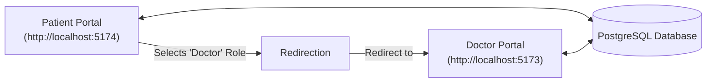
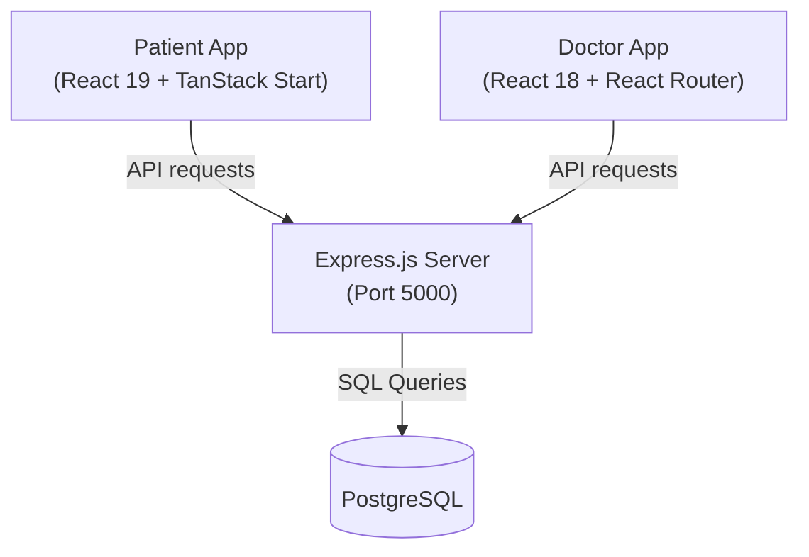

# ClinicCortex: Frontend Analysis & Integration Plan

This document provides a line-to-line analysis of both frontend applications (`Doctordashboarddesign` and `cliniccortex-patient-fe`), explains how to connect them logically and structurally, and details how to integrate them with a shared backend.

---

## 1. Line-by-Line / Component-by-Component Folder Analysis

### A. Doctor Dashboard: `Doctordashboarddesign/`
This is a standard React SPA built with React 18, Vite, and Tailwind CSS v4. It manages state locally using `localStorage` and mock datasets.

*   **`package.json`**:
    *   **Core dependencies**: Uses React 18 (`react` & `react-dom` 18.3.1), React Router v7 (`react-router-dom` 7.14.1), and Tailwind CSS v4.
    *   **UI/Styling**: Uses Radix UI primitives, Recharts (for charts), Lucide Icons, and `@mui/material`/`@mui/icons-material` for other icons.
    *   **Scripts**: Standard Vite configuration (`npm run dev` to start Vite, `npm run build` to build).
*   **`vite.config.ts`**:
    *   Sets up the Vite server with `@vitejs/plugin-react` and `@tailwindcss/vite` for Tailwind v4 integration.
*   **`src/main.tsx`**:
    *   Mounts the React application. Renders `<RouterProvider router={router} />` inside `document.getElementById("root")`.
*   **`src/app/routes.tsx`**:
    *   **Key Routing Setup**: Utilizes React Router v7 `createBrowserRouter`.
    *   **Auth Gate**: Protects the `/dashboard` route with `<RequireAuth>` by validating `localStorage.getItem("cliniccortex-auth") === "true"`.
    *   **Routes defined**:
        *   `/login` and `/signup`: Unprotected entry pages.
        *   `/dashboard`: Renders `<DashboardLayout />` containing a sidebar and sub-routes:
            *   `/dashboard` (Index): Main statistics and pending consultation lists.
            *   `appointments`: Lists and filters scheduled consultations.
            *   `schedule`: Modifies doctor slots and availability days.
            *   `patients` & `patient-records`: Lists patient directories and details.
            *   `inbox` / `messages`: Conversation threads between patient and doctor.
            *   `profile` & `settings`: Profile updates and account credentials.
*   **`src/app/components/`**:
    *   **[Login.tsx](file:///c:/Users/admin/Desktop/BCA/5th%20SEM/Clinic-Cortex/Doctordashboarddesign/src/app/components/Login.tsx) & [Signup.tsx](file:///c:/Users/admin/Desktop/BCA/5th%20SEM/Clinic-Cortex/Doctordashboarddesign/src/app/components/Signup.tsx)**: Forms to collect authentication parameters. Writes/reads plain strings in `localStorage` under `cliniccortex-auth` and `cliniccortex-account`.
    *   **[Dashboard.tsx](file:///c:/Users/admin/Desktop/BCA/5th%20SEM/Clinic-Cortex/Doctordashboarddesign/src/app/components/Dashboard.tsx)**: Renders stats summaries and consultation requests. Uses hardcoded figures.
    *   **[Appointments.tsx](file:///c:/Users/admin/Desktop/BCA/5th%20SEM/Clinic-Cortex/Doctordashboarddesign/src/app/components/Appointments.tsx)**: Filters consultations by tab (Upcoming, Completed, Missed, etc.). Writes status modifications back to local state/localStorage.
    *   **[Schedule.tsx](file:///c:/Users/admin/Desktop/BCA/5th%20SEM/Clinic-Cortex/Doctordashboarddesign/src/app/components/Schedule.tsx)**: Allows doctors to configure weekly slots. Uses local arrays.
    *   **[Inbox.tsx](file:///c:/Users/admin/Desktop/BCA/5th%20SEM/Clinic-Cortex/Doctordashboarddesign/src/app/components/Inbox.tsx)**: Displays message history.
*   **`src/app/lib/`**:
    *   Contains helper scripts like `appointmentData.ts` and `doctorProfile.ts` which mock database queries by seeding and retrieving from `localStorage`.

---

### B. Patient Portal: `cliniccortex-patient-fe/`
This is a mobile-responsive full-stack SSR application built with React 19, TanStack Start (file-based router framework), TanStack Query, and Tailwind CSS v4.

*   **`package.json`**:
    *   **Core dependencies**: Uses React 19 (`react` & `react-dom` 19.2.0), `@tanstack/react-start`, `@tanstack/react-router`, and `@tanstack/react-query` (version 5.83.0).
    *   **Deployments**: Includes `@cloudflare/vite-plugin` and a `wrangler.jsonc` configuration file, targeting deployment on Cloudflare Pages/Workers.
*   **`src/start.ts` & `src/server.ts`**:
    *   Entry points for hydration. `start.ts` starts client-side TanStack Start; `server.ts` configures server-side execution (SSR handlers).
*   **`src/routes/`**:
    *   **`__root.tsx`**: Sets up `QueryClientProvider` to wrap the app with TanStack Query. Embeds standard meta headers (SEO optimized tags like `"title": "Lovable App"`).
    *   **`index.tsx`**: Serves as the landing route (`/`). Uses a single controller `<Router />` to dynamically render sub-views based on custom React Context state.
*   **`src/lib/cc-state.tsx`**:
    *   **State Machine Context (`CCProvider`)**: Instead of standard browser routing, the client navigates via React state.
    *   **`flow` values**: `"gateway"` (intro splash screen) $\rightarrow$ `"language"` (choose local dialect) $\rightarrow$ `"identity"` (choose role: patient/doctor) $\rightarrow$ `"login"` / `"signup"` $\rightarrow$ `"app"` (enters patient dashboard shell).
    *   **`screen` values**: Home, booking, vitals, chat, settings, wallet, prescriptions, etc.
    *   **Language Dictionary (`DICTS`)**: Holds translations for languages (Hindi, Kannada, Bangla, Marathi, Tamil, etc.).
*   **`src/components/`**:
    *   **`cc-flows.tsx`**: Renders screens prior to dashboard access.
        *   `Identity`: Displays roles (Patient, Doctor, Lab Assist).
        *   `Login`: Allows login via simulated OTP or Biometric scan (Fingerprint).
        *   `Signup`: Renders standard patient registration input fields (Name, Age, Income, Email, Password).
    *   **`cc-screens.tsx`**: Renders screens inside the app.
        *   `HomeScreen`: Shows a quick service grid, upcoming appointments, and vitals overview.
        *   `AppointmentsScreen`: Allows looking up top doctors and lists current appointments.
        *   `DoctorDetail` & `BookingScreen`: Shows calendar dates/slots and handles booking selection.
        *   `ChatScreen`: Mocked patient-to-doctor thread.
        *   `GlucoseScreen` / `VitalsScreen`: Visualizes health metrics using custom SVG rings.
        *   `PharmacyScreen`: OTC/Rx medication list with checkout cart.
    *   **`cc-shell.tsx`**: The main frame. Provides header options (notifications, location) and bottom tab navigation links.

---

## 2. How to Connect Both Frontend Applications

To link these two applications, we must coordinate cross-origin interactions:



### Step 1: Subdomain or Different Ports Setup
1.  During development, assign fixed local ports in their respective `vite.config.ts` files:
    *   **Doctor Dashboard**: `http://localhost:5173`
    *   **Patient Dashboard**: `http://localhost:5174`
2.  In production, deploy them under the same domain using subdomains:
    *   **Doctor Dashboard**: `doctor.cliniccortex.com`
    *   **Patient Dashboard**: `patient.cliniccortex.com`

### Step 2: Role-Based Redirection
In the Patient Portal's Identity screen ([cc-flows.tsx](file:///c:/Users/admin/Desktop/BCA/5th%20SEM/Clinic-Cortex/cliniccortex-patient-fe/src/components/cc-flows.tsx) around line 99), when a user selects **"Doctor"** or **"Lab Assist"**, they should be redirected out of the patient app to the Doctor app:

```typescript
// cliniccortex-patient-fe/src/components/cc-flows.tsx
const handleRoleSelect = (selectedRole: Role) => {
  setRole(selectedRole);
  if (selectedRole === "doctor" || selectedRole === "lab") {
    // Redirect to Doctor Dashboard
    window.location.href = "http://localhost:5173/login"; 
  }
};
```

On the Doctor Dashboard login screen, add a redirect link back to the Patient App for patients who land there by mistake:
```tsx
// Doctordashboarddesign/src/app/components/Login.tsx
<p className="mt-4 text-sm text-slate-400">
  Are you a patient? <a href="http://localhost:5174" className="font-semibold text-sky-400 underline">Access Patient Portal</a>
</p>
```

### Step 3: Aligning Shared Data Types
Create a folder named `shared` or keep identical TypeScript interfaces for objects that cross over between both panels (e.g., `Appointment`, `DoctorProfile`, `Message`, `Vitals`).

---

## 3. How to Connect the Express.js Backend to Both

A single Express server will handle all database calls for both apps:



### Step 1: Start the PostgreSQL Database
Set up the database as specified in `database_setup.md`:
```bash
# 1. Create DB
psql -U postgres -c "CREATE DATABASE cliniccortex_db;"

# 2. Run schema to build the 12 tables (doctors, patients, appointments, messages, etc.)
psql -U postgres -d cliniccortex_db -f server/db/schema.sql

# 3. Seed with initial mock data
psql -U postgres -d cliniccortex_db -f server/db/seed.sql
```

### Step 2: Set up the Express.js Server
Create a `/server` folder in the project root with the modules described in `backend_setup.md`. Run it on `http://localhost:5000`.

#### Configure CORS in Express
The backend server must whitelist both frontends:
```javascript
// server/src/index.js
import cors from 'cors';

const whitelist = ['http://localhost:5173', 'http://localhost:5174'];
const corsOptions = {
  origin: function (origin, callback) {
    if (!origin || whitelist.indexOf(origin) !== -1) {
      callback(null, true);
    } else {
      callback(new Error('Not allowed by CORS'));
    }
  },
  credentials: true
};

app.use(cors(corsOptions));
```

---

### Step 3: Wire the Doctor Dashboard to the Backend
Replace `localStorage` calls inside the Doctor Dashboard with HTTP requests:

1.  **Install Axios (or use native fetch)**:
    ```bash
    cd Doctordashboarddesign && npm install axios
    ```
2.  **Create an API Utility**:
    Define a shared axios client `src/app/lib/api.ts` that includes the JWT token from `localStorage` in every header:
    ```typescript
    import axios from 'axios';

    const api = axios.create({
      baseURL: 'http://localhost:5000/api',
    });

    api.interceptors.request.use((config) => {
      const token = localStorage.getItem('cliniccortex-token');
      if (token) {
        config.headers.Authorization = `Bearer ${token}`;
      }
      return config;
    });

    export default api;
    ```
3.  **Update Login / Signup Logic**:
    Update `Login.tsx` to authenticate against the server:
    ```typescript
    // Doctordashboarddesign/src/app/components/Login.tsx
    const handleSubmit = async (e: FormEvent) => {
      e.preventDefault();
      try {
        const response = await api.post('/auth/login', { email, password });
        localStorage.setItem('cliniccortex-token', response.data.token);
        localStorage.setItem('cliniccortex-auth', 'true');
        navigate("/dashboard", { replace: true });
      } catch (err: any) {
        setError(err.response?.data?.message || "Invalid credentials");
      }
    };
    ```
4.  **Fetch Live Data**:
    Inside dashboard and appointment components, replace local arrays with `api.get('/appointments')` or `api.get('/dashboard/stats')`.

---

### Step 4: Wire the Patient Portal to the Backend
The Patient portal already has TanStack Query (`@tanstack/react-query`) set up. We can use it to fetch data reactively:

1.  **Configure Patient API client**:
    Create `cliniccortex-patient-fe/src/lib/api.ts`:
    ```typescript
    import axios from 'axios';

    export const api = axios.create({
      baseURL: 'http://localhost:5000/api',
    });

    // Automatically set Authorization header when token is present
    api.interceptors.request.use((config) => {
      if (typeof window !== "undefined") {
        const token = localStorage.getItem('cliniccortex-patient-token');
        if (token) {
          config.headers.Authorization = `Bearer ${token}`;
        }
      }
      return config;
    });
    ```
2.  **Create Data Fetching Hooks**:
    Create a hook in `cliniccortex-patient-fe/src/hooks/use-doctors.ts` to retrieve the registered doctors:
    ```typescript
    import { useQuery } from '@tanstack/react-query';
    import { api } from '@/lib/api';

    export function useDoctors() {
      return useQuery({
        queryKey: ['doctors'],
        queryFn: async () => {
          const res = await api.get('/doctors'); // Add GET /api/doctors endpoint to express
          return res.data;
        }
      });
    }
    ```
3.  **Implement Appointment Booking Mutation**:
    Create a mutation to send a POST request to `/appointments` when clicking the booking confirmation:
    ```typescript
    import { useMutation, useQueryClient } from '@tanstack/react-query';
    import { api } from '@/lib/api';

    export function useBookAppointment() {
      const queryClient = useQueryClient();
      return useMutation({
        mutationFn: async (appointmentData: { doctorId: string; date: string; time: string; visitType: string }) => {
          const res = await api.post('/appointments', appointmentData);
          return res.data;
        },
        onSuccess: () => {
          queryClient.invalidateQueries({ queryKey: ['appointments'] });
        }
      });
    }
    ```
4.  **Integrate inside UI**:
    Replace static structures in `cc-screens.tsx` (like `DOCTORS` and `confirm booking` button handlers) to use these hooks and triggers.
